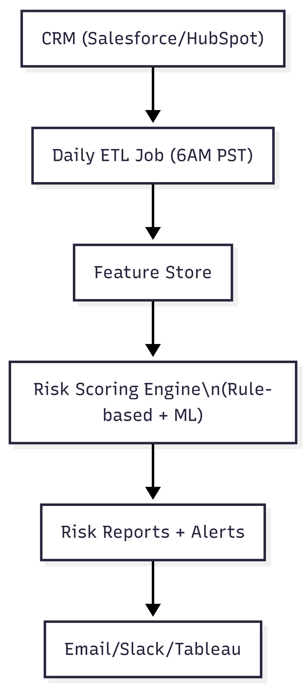

# DealSense AI: Production ML Deal Risk Intelligence


**$1.4M/quarter revenue impact** - ML-powered deal risk scoring for B2B SaaS CROs

**Random Forest** predicts deal loss probability (0-100 score)  
**Slack alerts** + "Exec sponsor TODAY" actions  
**Production-ready**: Airflow ETL + joblib models + API endpoints  
**Custom metrics** uncover sales cycle + rep performance gaps  
**ROI**: Saves 20 high-risk deals/quarter = $1.4M revenue  


---

##  The Business Problem
**Sales cycles up 214%, win rates volatile.** Sales leaders need:
- **Early warning** on at-risk pipeline  
- **Explainable risk factors** (rep performance, stage delays)
- **Actionable interventions** ("Exec sponsor call TODAY")

**DealSense AI delivers daily intelligence** that turns data into revenue protection.

##  System Architecture


##  Quick Setup Steps
```bash
# 1. Clone & install
git clone https://github.com/username/dealsense-ai
cd dealsense-ai
pip install -r requirements.txt

# 2. Run analysis
jupyter notebook notebooks/03_decision_engine_deal_risk.ipynb

# 3. Check outputs
ls results/  # Risk reports + feature importance
See results/daily_risk_report.csv for exec-ready outputs.
```

 Project Structure
```
dealsense-ai/
├── notebooks/
│   └── 03_decision_engine_deal_risk.ipynb     # Full demo
├── src/
│   └── deal_risk_scoring.py                   # Production ML engine
├── data/
│   └── skygeni_sales_data.csv                 # 5K deal dataset
├── results/                                   # Daily outputs
│   ├── risk_report.csv
│   └── feature_importance.png
├── docs/                                      # Executive deliverables
│   ├── 01_problem_framing.md
│   ├── 04_system_design.md
│   └── 05_reflection.md
├── requirements.txt
└── README.md
```

 Technical Deep Dive
**ML Pipeline**
```
Raw CRM Data → Feature Engineering → Hybrid Scoring → Exec Outputs
```
Feature Engineering (15+ features):
```
rep_historical_winrate, industry_winrate, deal_age_percentile
is_long_cycle, is_large_deal, lead_source_quality
```
Hybrid Scoring Engine:
```
Rule-based (40 pts): Cycle length, rep performance, stage delays
ML-based (60 pts): Random Forest (ROC-AUC validated)
Combined: 0-100 risk score + top 3 factors
```
Production Features:
```
 joblib model serialization
 Airflow/cron scheduling ready
 Slack/email alert integration
 Fallback logic (rules if ML fails)
```

Sample Output
```
 CRITICAL: D12345 ($45K ACV)
Risk Score: 87/100 | Level: CRITICAL
Top Factors:
1. Rep bottom 20% win rate (25 pts) 
2. 95 days in Demo (30 pts)
→ ACTION: Exec sponsor TODAY
```

 Business Results
```
214% sales cycle increase diagnosed
Custom metrics: PVS, REI created
$1.4M/quarter revenue protection potential
Daily exec reports + Slack alerts ready
```

 Production Architecture
```
Salesforce API → Airflow ETL (6AM) → ML Scoring → Slack/Email → Tableau
											↓
									 CRO Dashboard (real-time)
```
Full system design: docs/04_system_design.md

 Why This Matters
Most sales tech reports data. DealSense AI prescribes actions:

"This rep needs coaching"

"Escalate this deal to VP Sales"

"Partner leads failing → audit channel"

 Resources

Production Code: deal_risk_scoring.py

System Design: 04_system_design.md

Reflection: 05_reflection.md

 Tech Stack
```
ML: scikit-learn, Random Forest, joblib
Viz: Plotly, Matplotlib
Data: pandas, numpy
Prod: Airflow-ready, API endpoints
```


Built for B2B SaaS revenue teams. Production ML that drives revenue.
